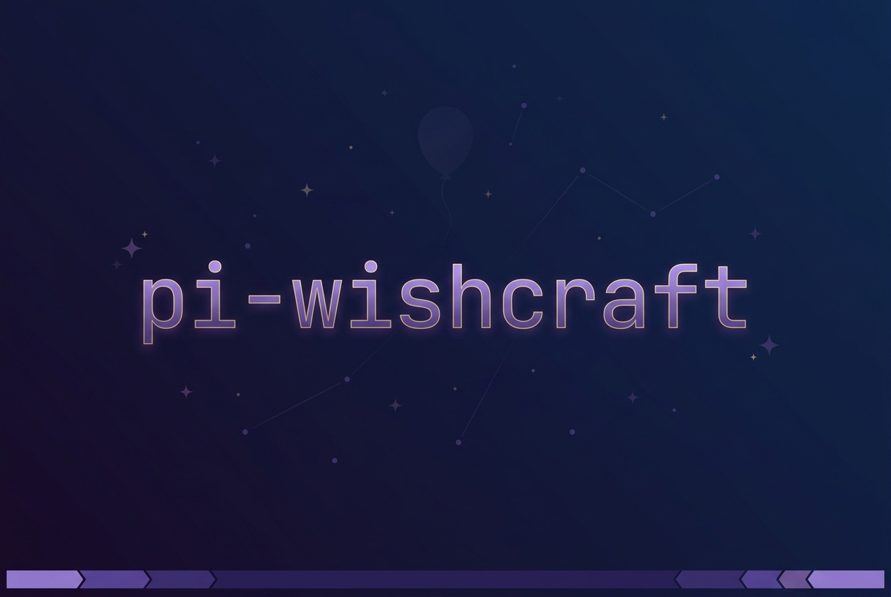

<p>
  
</p>

# pi-wishcraft

*Tweeduizend jaar geleden stuurden de Kongming-lantaarns als zwevende militaire seinen live visuele telemetrie over de vijandelijke linies. Door de eeuwen heen groeiden die lantaarns uit tot dragers van wensen: operatoren lieten hun gedachten opstijgen en maakten zo hun hoofd leeg.*

Deze extensie vertaalt die filosofie naar de [pi](https://github.com/badlogic/pi-mono) coding agent:
1. **Grondtelemetrie**: een live statusbalk onderaan het scherm met git, tokens/sec, contextvenster en actieve processpoorten (Alt+P).
2. **Vangen & loslaten (`# <idee>`)**: ideeën direct in de wachtrij zetten zonder de actieve agent-run te onderbreken.
3. **Autonome horizonten**: de wachtrij voedt background dreaming-SDK-routines, mission runners en autoresearch-loops terwijl je werkt of slaapt.
4. **Parkeren & omdraaien (Alt+S)**: een prompt-concept parkeren, snel een vraag stellen, en het automatisch terug laten komen.
5. **Sticky shell (`!cmd`)**: een blijvende bash-runtime binnen handbereik.

Geïnspireerd op [Powerlevel10k](https://github.com/romkatv/powerlevel10k) en [oh-my-pi](https://github.com/can1357/oh-my-pi).


## Functies

**Editor stash**: druk op `Alt+S` om je editor-inhoud op te slaan en de editor leeg te maken, typ een snelle prompt, en je gestashte tekst komt automatisch terug zodra de agent klaar is. Schakelt tussen stash, pop en bestaande-stash-bijwerken. Een `stash`-indicator verschijnt in de powerline-balk zolang er tekst gestasht is.

**Powerline-wachtrij + inbox**: leg gedachten vast zonder de huidige agent te onderbreken. Typ `# <idee>` en druk op Enter om een idee op te slaan in plaats van te versturen; `# @global <idee>`, `# @current <idee>` en `# @alias <idee>` routeren het naar de juiste plek. Berichten die tijdens compaction worden getypt, houdt Powerline vast en levert hij af ná een geslaagde compaction — ze verdwijnen dus niet in Pi's eigen wachtrij. `/idea`, `/ideas` en `/queue` geven een bestandsgebaseerde inbox voor sessie-prompts, projectideeën, aliassen, retries, clears en handmatige levering. Gebruik `/ideas next` om het oudste actieve idee in de huidige sessie te verwerken, of `/ideas issue` om het aan de huidige agent te geven voor veilige GitHub-issue-triage. Actieve wachtrij-, idee- en geblokkeerde-tellingen verschijnen in het `queue`-segment alleen als er iets te tonen valt.

**Working Vibes**: AI-gegenereerde thematische laadberichten. Zet `/vibe star trek` en je "Working..." wordt "Running diagnostics..." of "Engaging warp drive...". Ondersteunt elk thema: pirate, zen, noir, cowboy, etc.

**Welcome-overlay**: gebrandmerkt opstartscherm dat als gecentreerde overlay bij het starten verschijnt. Toont gradient-logo, modelinformatie, toetsenbordtips, aantallen geladen AGENTS.md/extensies/skills/templates, een schatting van de initiële systeemprompt-tokens en recente sessies. Verdwijnt automatisch na 30 seconden of bij elke toetsaanslag. Zet `powerline.welcome` op `false` om het uit te schakelen terwijl de footer aan blijft.

**Rounded box-ontwerp**: status wordt direct in de bovenrand van de editor weergegeven, niet als aparte footer.

**Native Pi-layout**: Pi blijft eigenaar van vaste input, feed-scrolling, selectie en terminalgedrag; deze extensie levert de powerline-widgets en de custom bash/stash/editor-integraties.

**Live thinking-level-indicator**: toont het huidige thinking-niveau (`think:off`, `think:med`, etc.) met kleuren per niveau. High-, xhigh- en max-niveaus gebruiken een regenboogeffect geïnspireerd op Claude Code's ultrathink.

**Slimme defaults**: Nerd Font-auto-detectie voor iTerm, WezTerm, Kitty, Ghostty en Alacritty met ASCII-fallbacks. Kleuren afgestemd op oh-my-pi's dark theme.

**Git-integratie**: async status-ophaling met 1s cache-TTL. Wordt automatisch ongeldig bij bestandswijzigingen. Toont branch, staged (+), unstaged (*) en untracked (?) tellingen.

**Contextbewustzijn**: kleurgecodeerde waarschuwingen boven 70% (geel) en boven 90% (rood) contextgebruik. Tijdens streaming ververst het context-segment vanuit live assistant-gebruik in plaats van te wachten op de volgende turn. Auto-compact-indicator wanneer ingeschakeld. Als `pi-custom-compaction` is geïnstalleerd en ingeschakeld, verbergt de powerline automatisch de native context-segmenten zodat de footer geen verouderd post-summary-gebruik toont.

**Token-intelligentie**: slimme opmaak (1.2k, 45M), used/max/percentage contextweergave, abonnementsdetectie en configureerbare abonnementskostenweergave.

**Sticky bash-modus**: schakel bash-modus met `ctrl+shift+b` of `/bash-mode`. Houdt een beheerde shell-sessie in leven voor de huidige pi-sessie, toont een dedicated `shell_mode`-segment, streamt commando-output naar een ingebed transcript onder de editor, en laat `cd` of geëxporteerde state overleven tussen commando's.

**Shell ghost-suggesties**: bash-modus is nu ghost-first. Succesvolle per-project shell-geschiedenis is de primaire bron, terwijl deterministische pad- en git-vervolgen een bestaand commando kunnen aanvullen. Shell-native completion-probes zijn uitgeschakeld zodat `!command`-voorspellingen nooit interactieve shell-completion-subprocessen starten. Op commandopositie lossen korte stammen eerst op uit het nieuwste succesvolle lokale commando, kunnen ze bewaakte globale shell-geschiedenis gebruiken voor hoogvertrouwde koppen zoals `git`, en vallen uiteindelijk terug op een kleine samengestelde standaardset als er geen geschiedenis is. Die set is nu `g` → `git status` en `c` → `cd ..`. Is de bash-prompt leeg, dan toont bash-modus direct de nieuwste succesvolle projectgeschiedenis-ghost-suggestie als die bestaat; anders blijft hij leeg. Dezelfde inline-voorspellingen werken nu ook voor eenmalige `!command`- en `!!command`-prompts. Rechterpijl of Tab accepteert ghost-tekst in de editor, en Enter voert het huidige shell-commando uit.

## Installatie

### Methode 1: via Pi Package Manager (aanbevolen)

```bash
pi install npm:@groeponline/pi-wishcraft
```

### Methode 2: one-liner / cloud agent-opstartscript (Cursor Cloud, Freebuff, Devcontainers, CI)

Voor tijdelijke VMs, cloud agents of dev-omgevingen zonder handmatige tussenkomst:

```bash
curl -fsSL https://raw.githubusercontent.com/GroepOnline/pi-wishcraft/main/scripts/install.sh | bash
```

Herstart of `/reload` pi om te activeren.

## Gebruik

Activeert automatisch. Schakel met `/powerline`, wissel presets met `/powerline <naam>` en verplaats de hoofdrij met `/powerline placement above|below|toggle`.

Gebruik `/cd <pad>` om het huidige gesprek vanuit een andere werkmap voort te zetten. Ondersteunt relatieve paden, absolute paden, `~`, `~/...` en directory-completions. Zonder argument print `/cd` de huidige Pi-sessiedirectory. Het commando schakelt over naar een cwd-bijgewerkt sessiebestand zodat Pi-tools en het footer-padsegment na de wijziging overeenkomen.

Powerline-wachtrij- en inbox-commando's en capture-sneltoetsen:

- `# <tekst>`: leg een idee vast voor het huidige project zonder het naar de agent te sturen
- `# @global <tekst>`: leg een globaal idee vast
- `# @current <tekst>`: leg een idee vast gericht op de huidige sessie
- `/queue alias <naam> [pad]`: sla een projectalias op, standaard de huidige cwd als `pad` wordt weggelaten
- `# @naam <tekst>`: leg een idee vast voor een opgeslagen projectalias
- `/compact <tekst>`: compact nu en zet `<tekst>` als volgende prompt na een geslaagde compaction
- `/idea [@doel] <tekst>`: commando-vorm van idee-vastleggen, handig voor scripts en gebruikers die het sigil uitschakelen
- `/idea issue [id]`: geef het oudste actieve idee, of een specifiek idee, aan de huidige agent voor veilige GitHub-issue-triage
- `/ideas`: open de picker voor vastgelegde ideeën
- `/ideas next`: stuur het oudste actieve idee naar de huidige sessie
- `/ideas issue [id]`: vraag de huidige agent om te dedupliceren en een GitHub-issue aan te maken, alleen als het doelrepo duidelijk en eigendom/beheerd is
- `/ideas send <id>`: stuur een idee naar de huidige sessie
- `/queue`: open de picker voor wachtrij-prompts
- `/queue send [id]` / `/queue retry [id]`: lever een wachtrij-item nu af
- `/queue clear <id|all>`: wis wachtrij-promptitems
- `/queue target <id> @naam|global|current`: herricht een wachtrij-item

Het standaard capture-sigil is `#`. Begint de editor-tekst met `# `, dan verandert het prompt-glyph in `#`; Enter slaat het idee op, maakt de editor leeg en laat de oorspronkelijke sigil-tekst in de editor-geschiedenis staan voor snel herstel. Configureer of schakel dit uit onder `powerline.queue.captureSigil`:

```json
{
  "powerline": {
    "queue": {
      "captureSigil": "#"
    }
  }
}
```

Zet `captureSigil` op `false` als je vaak markdown-koppen verstuurt en liever `/idea` gebruikt.

Vastgelegde data staat in de Pi-agentdirectory onder `powerline-footer/inbox.jsonl` en `powerline-footer/projects.json`. `inbox.jsonl` is een stabiel leesoppervlak voor orchestrators en helper agents; elke regel is een wachtrij-item met `id`, `text`, `createdAt`, `updatedAt`, `source`, `target`, `intent`, `status` en optioneel `error`. Schrijven moet nog steeds via Powerline-commando's of de store gaan zodat locking en atomische writes behouden blijven. Ideeën die via `/ideas next` of `/ideas send <id>` worden verstuurd, bevatten een kleine provenance-header zodat de ontvangende agent ze als uitgestelde vastgelegde context kan behandelen. `/idea issue` en `/ideas issue` maken geen issues direct vanuit de extensie; ze sturen een beveiligde handoff-prompt die de huidige agent vertelt eerst open issues te dedupliceren, alleen een GitHub-issue aan te maken voor een duidelijk eigendom/beheerd repo, en te vragen vóór het aanmaken als het doel onduidelijk is.

- `/powerline placement below`: verplaats de hoofd-powerline-rij onder de editor
- `/powerline placement above`: herstel de standaardplaatsing
- `/powerline placement toggle`: wissel tussen boven en onder

Je kunt het ook instellen in het agent-settingsbestand (`~/.pi/agent/settings.json` standaard, of onder `PI_CODING_AGENT_DIR`) of project-lokaal `.pi/settings.json`:

```json
{
  "showLastPrompt": true,
  "powerline": {
    "preset": "default",
    "placement": "below",
    "welcome": true
  }
}
```


| Preset | Beschrijving |
|--------|-------------|
| `default` | Model, thinking, pad (basename), git, context, tokens, kosten |
| `minimal` | Alleen pad (basename), git, context |
| `compact` | Model, git, kosten, context |
| `full` | Alles inclusief hostname, tijd, afgekort pad |
| `nerd` | Maximale details voor Nerd Font-gebruikers |
| `ascii` | Veilig voor elke terminal |
| `chef` | Fork-standaard: gedempte kleuren, slash-separators, TPS- en open-poorten-segmenten |

**Omgeving:** `POWERLINE_NERD_FONTS=1` om Nerd Fonts te forceren, `=0` voor ASCII.

Preset-keuze wordt opgeslagen onder `powerline` in het agent-settingsbestand en bij opstart hersteld.
Draai `/powerline default` om terug te schakelen naar de standaardpreset.

### Custom items uit extensie-statussen

Je kunt elke extensie-statuskey promoveren naar een eigen dedicated powerline-item. Zo krijg je een generieke manier om eigen statusitems te registreren zonder deze extensie te wijzigen.

1. Elke extensie kan statustekst publiceren via `ctx.ui.setStatus("my-key", "...waarde...")`.
2. Configureer `powerline.customItems` om die keys links, rechts of op de secundaire rij te plaatsen.

```json
{
  "powerline": {
    "preset": "default",
    "customItems": [
      {
        "id": "ci",
        "statusKey": "ci-status",
        "position": "right",
        "prefix": "CI",
        "color": "warning"
      },
      {
        "id": "review",
        "position": "secondary",
        "hideWhenMissing": false,
        "prefix": "review"
      }
    ]
  }
}
```

`customItems`-velden:

- `id` (verplicht): uniek item-id (`a-z`, `A-Z`, `0-9`, `_`, `-`)
- `statusKey` (optioneel): extensie-statuskey om te lezen, standaard `id`
- `position` (optioneel): `left`, `right` of `secondary` (standaard `right`)
- `prefix` (optioneel): tekst vóór de live statuswaarde
- `color` (optioneel): elke Pi-themakleur (`warning`, `accent`, etc.) of hex (`#RRGGBB`)
- `hideWhenMissing` (optioneel): verberg item als er geen status is (standaard `true`)
- `excludeFromExtensionStatuses` (optioneel): laat deze key weg uit het geaggregeerde `extension_statuses`-segment (standaard `true`)

Geef je de voorkeur aan de oudere string-presetconfiguratie, dan blijft `"powerline": "default"` gewoon werken. De string-preset-shorthand houdt `welcome` ingeschakeld en gebruikt de standaard sneltoets/kosten/model-weergave-instellingen.

### Custom segmenten (berekend, zonder code)

Definieer je eigen segmenten direct in de settings: draai een commando, lees een env-var of toon statische tekst. Geen TypeScript nodig.

```json
{
  "powerline": {
    "preset": "chef",
    "segments": {
      "battery": { "type": "command", "command": "cat /sys/class/power_supply/BAT0/capacity", "prefix": "batt", "cacheMs": 30000 },
      "who":     { "type": "env", "env": "USER", "prefix": "u", "color": "#888888" },
      "chef":    { "type": "static", "text": "CHEF", "color": "accent" }
    }
  }
}
```

Elk segment wordt bruikbaar in een preset als `custom:<id>` (bijv. `custom:battery`).

Segmentvelden:

- `type` (verplicht): `command` | `env` | `static`
- `command` (command-type): shell-commando om te draaien; output wordt getrimd
- `cacheMs` (command-type, optioneel): cache output N ms om niet elke paint een shell te herstarten
- `env` (env-type): omgevingsvariabele om te lezen
- `fallback` (env-type, optioneel): tekst bij een niet-gezette variabele (weglaten om het segment te verbergen)
- `text` (static-type): vaste tekst
- `prefix` (optioneel): tekst vóór de waarde
- `color` (optioneel): Pi-themakleur (`warning`, `accent`, ...) of hex (`#RRGGBB`)

Faalt een commando of is een env-var niet gezet zonder fallback, dan rendert het segment niets.

### Custom presets

Definieer je eigen preset in de settings; die merge over de built-ins heen en is selecteerbaar via `powerline.preset` (of `/powerline <naam>`).

```json
{
  "powerline": {
    "preset": "mine",
    "segments": { "battery": { "type": "command", "command": "cat /sys/class/power_supply/BAT0/capacity", "prefix": "batt" } },
    "presets": {
      "mine": {
        "left": ["hostname", "model", "custom:battery", "git"],
        "right": ["tps", "open_ports", "cost", "time"],
        "separator": "slash",
        "colors": { "model": "text" },
        "segmentOptions": { "path": { "mode": "basename" } }
      }
    }
  }
}
```

### De `chef`-preset en interactieve commando's

`preset: "chef"` is de standaardlook van de GroepOnline-fork: gedempte kleuren (geen regenboog), slash-separators en twee extra rechtse segmenten:

- `tps`: live tokens/sec, rollend 1-secondevenster (EMA-vrij, geen spikes); een raket/bliksemicoon licht op tijdens genereren (override met env `POWERLINE_TPS`)
- `open_ports`: aantal unieke **TCP**-luisterpoorten (`ss` → `netstat` → `/proc/net` fallback, dedupliceert IPv4/IPv6). Zet `segmentOptions.openPorts.includeUdp: true` om lawaaierige UDP mee te nemen (mDNS/DHCP/ephemeral).

Interactiviteit (Pi-core rendert de footer als statische tekst, dus live klikken is niet mogelijk; acties leven in commando's en een navigeerbare overlay):

- `/tps [waarde]`: toon of zet `POWERLINE_TPS`
- `/open-ports`: toon luisterpoorten en kies er een
- `alt+p`: **powerline-menu**: navigeer door de live segmenten (`↑`/`↓` + `enter`), configureer (preset / TPS / UDP / labels) of open de volledige poortenlijst
- `alt+i`: **powerline-info**: volledige open-poortenlijst

Zowel `alt+p` als `alt+i` zijn herbindbaar (zie Keybinds hieronder); wijzigingen gelden na `/reload`.

### Sneltoetsen

De powerline-menu- en info-sneltoetsen zijn configureerbaar via `powerlineShortcuts` (zelfde map als de andere powerline-sneltoetsen), met automatische conflictoplossing. Zet een binding op `null` om hem uit te schakelen.

```json
{
  "powerlineShortcuts": {
    "menu": "alt+p",
    "info": "alt+i"
  }
}
```

Wijzigingen gelden na `/reload` (de extensie registreert sneltoetsen opnieuw bij reload).

### Segmentlabels (custom tekst)

Hernoem de tekst van elk segment via `powerline.segmentLabels` (een map van segment-id → label). Het label verschijnt tussen het icoon en de waarde.

```json
{
  "powerline": {
    "segmentLabels": {
      "tps": "speed",
      "open_ports": "ports"
    }
  }
}
```

### Segmenten uitschakelen

Zet `powerline.disabledSegments` om built-in of geconfigureerde custom segmenten uit de actieve preset te verbergen:

```json
{
  "powerline": {
    "preset": "default",
    "disabledSegments": ["cost", "extension_statuses", "custom:ci"]
  }
}
```

Built-in namen staan onder Segmenten hieronder. Custom items gebruiken `custom:<id>`. Onbekende namen worden genegeerd met een opstartwaarschuwing.

### Custom layout

Gebruik `powerline.layout` om segmentvolgorde en groepering te overriden terwijl de kleuren en segmentopties van de gekozen preset behouden blijven. Zet `powerline.separator` als je een separatorstijl wilt onafhankelijk van de preset:

```json
{
  "powerline": {
    "preset": "default",
    "separator": "chevron",
    "layout": {
      "left": ["model", "thinking", "path", "git"],
      "right": ["context_pct", "cost"],
      "secondary": ["custom:ci"]
    },
    "customItems": [
      { "id": "ci", "statusKey": "ci-status" }
    ]
  }
}
```

Een aanwezige `left`-, `right`- of `secondary`-array vervangt die presetgroep exact; een lege array wist hem. Weggelaten groepen behouden de preset-items en voegen custom items automatisch toe op hun geconfigureerde `position`. Een segment expliciet vermelden verplaatst het uit weggelaten presetgroepen, en expliciet geplaatste custom items worden nergens anders automatisch toegevoegd. `disabledSegments` wordt toegepast ná layout. `separator` accepteert elke hieronder genoemde stijl; laat hem weg om de separator van de preset te houden.

Responsief gedrag is ongewijzigd: deze groepen bepalen volgorde en overflow-prioriteit, geen permanent vastgepinde terminalrijen. `right` betekent "latere primaire segmenten", geen uitlijning op de rechterrand. Op brede terminals passen secundaire items in de bovenbalk; op smalle terminals schuift primaire overflow naar de secundaire regel. Sommige segmenten zijn verborgen als ze geen waarde hebben, dus `thinking` verschijnt alleen als de actieve sessie/model een niet-`off` thinking-niveau rapporteert. Onbekende items worden genegeerd met een opstartwaarschuwing. De oude vaste `custom`-preset is verwijderd; combineer elke preset met `layout` in plaats daarvan.

### Demo-settings

Voor een compacte huidige footer-opstelling:

```json
{
  "powerline": {
    "preset": "default",
    "path": { "mode": "basename" },
    "model": { "display": "name" },
    "cost": { "subscriptionDisplay": "subscription", "currency": "USD" }
  }
}
```

Gebruik `"model": { "display": "qualified" }` als twee providers modellen met dezelfde weergavenaam aanbieden.

`cost.currency` accepteert `USD`, `CNY`, `EUR`, `GBP`, `JPY`, `CAD`, `AUD`, `CHF`, `INR` of `KRW`. Pi rapporteert kosten in USD; niet-USD-weergave gebruikt een keyless USD-wisselkoers die op de achtergrond wordt opgehaald en 24 uur gecached wordt in de Pi-agentdirectory. Is er nog geen gecachete koers, dan rendert het kosten-segment `-- CODE` tot een latere footer-verversing de koers kan gebruiken.

Abonnementskostenweergave:

| Modus | Abonnement + gerapporteerde kosten | Abonnement + geen gerapporteerde kosten |
|------|------------------------------|----------------------------------|
| `subscription` | `(sub)` | `(sub)` |
| `reported-cost` | `$0.12` | `(sub)` |
| `both` | `$0.12 (sub)` | `(sub)` |

Segmentweergaveformaten (opt-in; defaults matchen de historische weergave):

| Segmentoptie | Waarden | Standaard | Effect |
|---|---|---|---|
| `"context": { "format" }` | `"full"` / `"percent"` | `"full"` | `"percent"` toont een kale afgeronde `83%` (drempelgekleurd, zonder icoon) in plaats van `12k/200k (6.2%)` |
| `"cache_read": { "format" }` | `"tokens"` / `"percent"` / `"both"` | `"tokens"` | `"percent"` toont de cache-hitrate `cacheRead / (input + cacheRead)` in plaats van het ruwe tokental; `"both"` toont ruwe tokens plus de hitrate, bijv. `cache in: 12k (80%)` |

```json
{
  "powerline": {
    "context": { "format": "percent" },
    "cache_read": { "format": "both" }
  }
}
```

## Bash-modus

Schakel bash-modus in met een van:

- `ctrl+shift+b`
- `/bash-mode on`
- `/bash-mode off`
- `/bash-mode toggle`

Reset de beheerde shell met `/bash-reset`.

Zolang bash-modus actief is:

- Enter voert het huidige shell-commando uit
- Rechterpijl accepteert ghost-tekst in de editor zonder het uit te voeren
- Tab accepteert de huidige ghost-suggestie als die bestaat; anders doet hij niets
- Pijl omhoog en omlaag bladeren door overeenkomende shell-geschiedenis
- `escape` verlaat bash-modus en keert terug naar de normale prompt-modus
- `ctrl+c` onderbreekt de actieve shell-taak voordat het terugvalt op normaal pi-gedrag

De beheerde shell blijft bestaan voor de huidige pi-sessie. Commando-output verschijnt in een transcript onder de editor, en shell-cwd-wijzigingen worden weerspiegeld in het footer-pad en het `shell_mode`-segment. Is de bash-prompt leeg, dan toont bash-modus direct de nieuwste succesvolle projectgeschiedenis-ghost-suggestie als die bestaat — ook direct na modusinvoer of nadat de prompt weer is leeggemaakt. Eenmalige `!command`- en `!!command`-prompts gebruiken dezelfde shell-voorspellingspijplijn, inclusief ghost-tekst. Modusinvoer blijft rustig: er is geen automatische of handmatige dropdown-completion-oppervlakte, en ghost-suggesties draaien geen shell-native completion-probes.

### Bash-modusconfiguratie

In `~/.pi/agent/settings.json` (of onder `PI_CODING_AGENT_DIR` als die omgevingsvariabele is gezet):

```json
{
  "bashMode": {
    "toggleShortcut": "ctrl+shift+b",
    "transcriptMaxLines": 2000,
    "transcriptMaxBytes": 524288
  }
}
```

## Editor stash

Gebruik `Alt+S` / `Option+S` als snelle stash-toggle tijdens het schrijven. Houdt één actieve stash bij en maakt de editor leeg bij het stashen. Powerline luistert standaard naar ondubbelzinnige Alt/Meta-S-escape-encodings. Zendt je oude terminalopstelling voor Option+S alleen het afdrukbare Duitse scherpe-S-teken, en wil je dat die toch stash triggert, zet dan `"stashSharpSShortcut": true` onder `powerline`.

| Editor | Stash | `Alt+S`-resultaat |
|--------|-------|----------------|
| Heeft tekst | Leeg | Stash huidige tekst, maak editor leeg |
| Leeg | Heeft stash | Herstel stash in editor |
| Heeft tekst | Heeft stash | Werk stash bij met huidige tekst, maak editor leeg |
| Leeg | Leeg | Toon "Niets te stashen" |

Auto-herstel na een agent-run gebeurt alleen als de editor nog steeds leeg is. Heb je inmiddels getypt, dan blijft de stash bewaard.

De `stash`-indicator verschijnt in de powerline-balk (op presets met `extension_statuses`). De actieve stash is sessielokaal en reset bij sessiewissel / uitschakelen, maar stash-geschiedenis wordt gepersisteerd naar de agentdir onder `powerline-footer/stash-history.json`, zodat hij herstarts overleeft. Standaard is de agentdir `~/.pi/agent`; zet `PI_CODING_AGENT_DIR` om globale powerline-settings, stash-geschiedenis, sessies, vibes, skills, commando's en extensiedetectie met Pi mee te verplaatsen.

### Stash-geschiedenis

Open prompt-geschiedenis met een van:

- `ctrl+alt+h`
- `/stash-history`

Prompt-geschiedenis heeft nu twee bronnen:

- gestashte prompts: tot 12 recente gestashte prompts (nieuwste eerst)
- recente projectprompts: tot 50 recente door de gebruiker ingediende prompts uit pi-sessies in de huidige projectmap

Een gestashte entry selecteren laat je hem invoegen of promoveren naar een idee. Projectprompt-geschiedenis-items worden in de editor ingevoegd. Heeft de editor al tekst, dan kun je kiezen tussen `Vervangen`, `Toevoegen` of `Annuleren`.

### Editor-klembord en navigatiesneltoetsen

- `ctrl+alt+c`: kopieer volledige editor-inhoud
- `ctrl+alt+x`: knip volledige editor-inhoud (kopiëren, dan leegmaken)
- `ctrl+alt+q`: open de picker voor wachtrij-prompts
- `cmd+shift+up`: verplaats de editor-cursor naar het begin van de eerste regel
- `cmd+shift+down`: verplaats de editor-cursor naar het einde van de laatste regel

Kopieer-/knip-acties wijzigen de stash-state of stash-geschiedenis niet. Bestanden, mappen, afbeeldingen of screenshots vanuit Finder naar de custom editor slepen voegt hun padstrings in. Pi blijft eigenaar van chat-scrolling, selectie en vast input-gedrag.

### Sneltoetsconfiguratie

Je kunt sneltoetsen overriden in het agent-settingsbestand:

```json
{
  "powerlineShortcuts": {
    "stashHistory": "ctrl+alt+h",
    "copyEditor": "ctrl+alt+c",
    "cutEditor": "ctrl+alt+x",
    "ideaCapture": null,
    "queueOpen": "ctrl+alt+q",
    "editorStart": "cmd+shift+up",
    "editorEnd": "cmd+shift+down"
  }
}
```

Na het wijzigen van bindingen: draai `/reload`. Ongeldige bindingen, gereserveerde key-conflicten zoals `Alt+S` of duplicate-conflicten vallen terug op veilige defaults. Zet een binding op `null` of `""` om die actie uit te schakelen. `cmd` en `command` zijn geaccepteerde aliassen voor Pi's `super`-modifier voor de gedocumenteerde Command-navigatietoetsen.

### Editor-autocomplete-compositie

Powerline wikkelt Pi's autocomplete-provider in zodat bash-modus shell-bewuste suggesties kan toevoegen. Was er al een andere editor-extensie geïnstalleerd, dan geeft powerline Pi's provider eerst door aan die eerdere editor's `setAutocompleteProvider()` en wikkelt daarna de resulterende provider. Zo blijven eerdere autocomplete-provider-wrappers waar mogelijk behouden, maar het is geen volledige render/input-compositie tussen custom editors.

## Working Vibes

Transformeer saaie "Working..."-berichten in thematische frasen die bij jouw stijl passen:

```
/vibe star trek    → "Running diagnostics...", "Engaging warp drive..."
/vibe pirate       → "Hoisting the sails...", "Charting course..."
/vibe zen          → "Breathing deeply...", "Finding balance..."
/vibe noir         → "Following the trail...", "Checking the angles..."
/vibe              → Toont huidige thema, modus en model
/vibe off          → Schakelt uit (terug naar "Working...")
/vibe model        → Toont huidige model
/vibe model openai/gpt-4o-mini → Gebruik een ander model
/vibe mode         → Toont huidige modus (generate of file)
/vibe mode file    → Schakel naar bestandsgebaseerde modus (direct, geen API-calls)
/vibe mode generate → Schakel naar on-demand generatie (contextueel)
/vibe generate mafia 200 → Genereer vooraf 200 vibes en sla ze op in een bestand
```

### Configuratie

In het agent-settingsbestand:

```json
{
  "workingVibe": "star trek",                              // Thema-frase
  "workingVibeMode": "generate",                           // "generate" (on-demand) of "file" (vooraf gegenereerd)
  "workingVibeModel": "openai-codex/gpt-5.4-mini",         // Optioneel: model om te gebruiken (standaard)
  "workingVibeFallback": "Working",                        // Optioneel: fallback-bericht
  "workingVibeRefreshInterval": 30,                        // Optioneel: seconden tussen verversingen (standaard 30)
  "workingVibePrompt": "Generate a {theme} loading message for: {task}",  // Optioneel: custom prompt-template
  "workingVibeMaxLength": 65                         // Optioneel: maximale berichtlengte (standaard 65)
}
```

### Modi

| Modus | Beschrijving | Voordelen | Nadelen |
|------|-------------|------|------|
| `generate` | On-demand AI-generatie (standaard) | Contextueel, hint naar de echte taak | Modelafhankelijke kosten en latentie |
| `file` | Uit vooraf gegenereerd bestand | Direct, nul kosten, werkt offline | Niet contextueel |

**File-modus instellen:**
```bash
/vibe generate mafia 200    # Genereer 200 vibes, sla op in de agentdir
/vibe mode file             # Schakel naar file-modus
/vibe mafia                 # Gebruikt nu het bestand
```

**Hoe file-modus werkt:**
1. Vibes worden vanuit `vibes/{theme}.txt` in de agentdir in het geheugen geladen
2. Gebruikt geseede shuffle (Mulberry32 PRNG): doorloopt alle vibes vóór herhaling
3. Nieuw zaad per sessie: elke pi-herstart een andere volgorde
4. Nul latentie, nul kosten, werkt offline

**Prompt-template-variabelen (alleen generate-modus):**
- `{theme}`: het huidige vibe-thema (bijv. "star trek", "mafia")
- `{task}`: context-hint (aanvankelijk de gebruikersprompt, daarna de agent-response-tekst of tool-info bij verversing)
- `{exclude}`: recente vibes om te vermijden (automatisch gevuld, bijv. "Don't use: vibe1, vibe2...")

**Hoe het werkt:**
1. Bij het versturen van een bericht toont "Channeling {theme}..." als placeholder
2. AI genereert op de achtergrond een thematisch bericht (3s timeout)
3. Het bericht wordt bijgewerkt naar de thematische versie (bijv. "Engaging warp drive...")
4. Bij lange taken verversing bij tool-calls (rate-limited, standaard 30s)
5. Kosten en latentie hangen af van je geconfigureerde `workingVibeModel`

## Thinking-niveauweergave

Het thinking-segment toont live updates wanneer je het thinking-niveau wijzigt:

| Niveau | Weergave | Kleur |
|-------|---------|-------|
| off | `think:off` | grijs |
| minimal | `think:min` | paars-grijs |
| low | `think:low` | blauw |
| medium | `think:med` | teal |
| high | `think:high` | regenboog |
| xhigh | `think:xhigh` | regenboog |
| max | `think:max` | regenboog |

## Padweergave

Het pad-segment ondersteunt drie modi:

| Modus | Voorbeeld | Beschrijving |
|------|---------|-------------|
| `basename` | `powerline-footer` | Alleen de directorynaam (standaard) |
| `abbreviated` | `…/extensions/powerline-footer` | Volledig pad met afgekorte home en lengtelimiet |
| `full` | `~/.pi/agent/extensions/powerline-footer` | Compleet pad met afgekorte home |

Configureer via presetopties: `path: { mode: "full" }`

## Git-polling

Standaard pollt het git-segment zowel branch als dirty-state. Als achtergrond-`git status --porcelain`-calls je workflow storen, gebruik dan branch-only polling:

```json
{
  "powerline": {
    "git": { "polling": "branch" }
  }
}
```

Gebruik `"off"` om extensie-eigendom git-polling volledig uit te schakelen en alleen de door Pi gerapporteerde branch te tonen wanneer beschikbaar.

## Git-hosticoon

Zet `git.hostIcon` om het branch-icoon te vervangen door het logo van de origin-remote:

```json
{
  "powerline": {
    "git": { "hostIcon": true }
  }
}
```

De origin-remote wordt gedetecteerd (SSH of HTTPS) en toegewezen aan een icoon: GitHub (), GitLab (), Bitbucket () of een generiek git-logo () voor elke andere remote (self-hosted, Gitea, Codeberg, …). Repositories zonder origin-remote houden het gewone branch-icoon (), net als ASCII- (niet–Nerd Font) opstellingen. De remote wordt één keer gelezen en gecached, dus dit kost niets per render. Standaard is `false` (branch-icoon ongewijzigd).

## Segmenten

`model` · `thinking` · `shell_mode` · `path` · `git` · `subagents` · `token_in` · `token_out` · `token_total` · `cost` · `context_pct` · `context_total` · `time_spent` · `time` · `session` · `hostname` · `cache_read` · `cache_write` · `extension_statuses`

## Separators

`powerline` · `powerline-thin` · `slash` · `pipe` · `dot` · `chevron` · `star` · `block` · `none` · `ascii`

## Theming

Kleuren zijn configureerbaar via pi's themasysteem. Elke preset definieert zijn eigen kleurenschema, en je kunt individuele kleuren en iconen overriden met een `theme.json`-bestand in de extensiedirectory.

### Standaardkleuren

| Semantisch | Thema-kleur | Beschrijving |
|----------|-------------|-------------|
| `model` | `#d787af` | Modelnaam |
| `shellMode` | `accent` | Bash-modussegment |
| `path` | `#00afaf` | Directorypad |
| `gitClean` | `success` | Git-branch (schoon) |
| `gitDirty` | `warning` | Git-branch (vervuild) |
| `thinking` | `thinkingOff` | Thinking-niveau (`off`) |
| `thinkingMinimal` | `thinkingMinimal` | Thinking-niveau (`minimal`) |
| `thinkingLow` | `thinkingLow` | Thinking-niveau (`low`) |
| `thinkingMedium` | `thinkingMedium` | Thinking-niveau (`medium`) |
| `context` | `dim` | Contextgebruik |
| `contextWarn` | `warning` | Contextgebruik >70% |
| `contextError` | `error` | Contextgebruik >90% |
| `cost` | `text` | Kostenweergave |
| `tokens` | `muted` | Tokentellingen |

### Custom thema-override

Maak `extensions/powerline-footer/theme.json` in de agentdir (`~/.pi/agent` standaard, of `PI_CODING_AGENT_DIR` wanneer gezet):

```json
{
  "colors": {
    "model": "accent",
    "shellMode": "accent",
    "path": "#00afaf",
    "gitClean": "success",
    "thinking": "thinkingOff",
    "thinkingMinimal": "thinkingMinimal",
    "thinkingLow": "thinkingLow",
    "thinkingMedium": "thinkingMedium"
  },
  "icons": {
    "auto": "↯",
    "warning": ""
  }
}
```

Kleuren kunnen zijn:
- **Themakleurnamen**: `accent`, `muted`, `dim`, `text`, `success`, `warning`, `error`, `border`, `borderAccent`, `borderMuted`
- **Hex-kleuren**: `#ff5500`, `#d787af`

Iconen kunnen elke string zijn, inclusief `""` als je een specifiek glyph volledig wilt onderdrukken.

Bij npm-package-installs is dit gedocumenteerde agentdir-bestand apart van de packagebestanden onder `~/.pi/agent/npm/node_modules`. De extensie leest eerst de agentdir-override en valt dan terug op een `theme.json` naast het geladen extensiebestand. Gebruik `/reload` of herstart Pi na het aanmaken of bewerken van `theme.json`.

Zie `theme.example.json` voor alle beschikbare opties.
